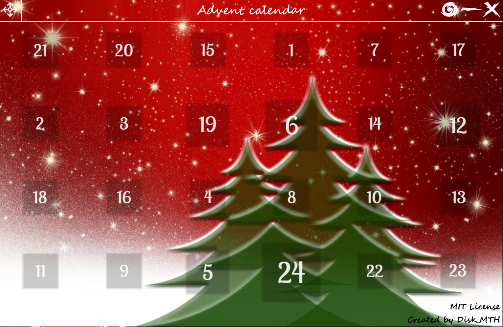
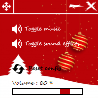

# Advent calendar
This project is under development, so it is not complete. All that is indicated below is 
therefore not yet contractual.

## Presentation
This github repository is a remake of my "[Christmas card](https://github.com/Disk-MTH/Christmas-card)" project resulting from a work requested in a maths 
lesson. The original project was fun to make but this version lets you tweak what's behind the calendar boxes.  In this projects I therefore use tkinter for the GUI, pygame for sounds, threading for concurrent 
programming, all under python 3.10.0. I have also added a settings backup 
system, so when you reopen the app after changing your settings, they will be 
kept. In addition, the configuration is self-checked so if you ever modify the file 
anyhow, or delete it the default settings will be reset. The application is also 
multi-threaded: the image, the sound and the configuration management 
system are completely independent in their operation but if the GUI thread stops 
(when you close the application), everything is stops.

## How to use and edit ?

This project is completely self-contained: you don't need to have python installed, 
or anything else!

**__/!\ WARNING :__**

If during one of the following steps a SmartScreen window opens saying 
"SmartScreen to protect your computer", this is normal: the .exe files (which I made 
entirely myself) do not have a digital signature therefore windows defender is in panic. 
(If ever you do not trust my scripts do not go further because you will necessarily 
need them! Moreover you can see their "contents" in the "uncompiled scripts" folder).

Once the environment is setup (see below), it will take VERY long to move the folder, 
so choose a "permanent" location!

###Use :

1) Download :

To start, above the frame containing the code, there is a green button titled "Code", 
click on it, then on "Download ZIP" (or use this link). This will download you a .zip 
folder which you will need to extract (I recommend extracting to the desktop). 

2) Setup :

(Warning : This step can be very long (depends on your computer)) Then in the 
unzipped folder find the "scripts" folder and run the "setup.exe" file. This will open a 
window of the control terminal in which you will be able to follow the decompilation of 
the integrated python interpreter. (If you go back to the root folder of the project you 
can find a "python" folder that has been created).

/!\ : In case of update, if you recompile the python environment, it will overwrite the old 
one

3) Run :

To launch the application you simply need to run the "run.exe" file that you may have 
seen in the "scripts" folder.

4) Build :

To compile the program, nothing could be easier: all you have to do is run the 
"build.exe" file and a control terminal window will open. Wait for the end of the 
execution (when the terminal displays "press a key to continue ...") and you will see in 
the main folder a "build" folder in which 2 folders and 1 file will be present. go to the 
"dist" folder and you will have your compiled application. (If there is no icon or if the 
images do not all work, check the name of your images and restart a compilation. If 
that still does not work open an issue).

/!\ : If you ever rebuild the program after making changes, the program will overwrite 
the old build files.

###Edit :

1) Title bar :

The app's title bar is an image overlaid on top of the rest, so you can edit it if 
you want. To do this, I provide you with the image of the blank title bar in the 
"pictures" folder. Have image editing software you can add whatever you want. 
(To make the default title bar I used the "Segoe Script" font in size 18). Once 
modified save it in the following path: "youtProjectPath/diskmth/resources" 
with the following name: "main_title_bar" in ".png" format.

2) Pictures behind the day buttons :

soon ...

## Pictures
MainGUI :

ConfigGUI :

## Informations
So that you can recover the background image, that you can modify and 
redistribute this project, the credits are an overlay image so you can remove it. 
(If you are reusing the project in any way, please cite this repository link to give 
me visibility for my future projects).

## License
All the files in this repository are completely free of rights (see the [license](https://github.com/Disk-MTH/Advent-calendar/blob/master/license.txt)) so 
you can grab the images, the code ... and do whatever you want with them (just 
respect the [license](https://github.com/Disk-MTH/Advent-calendar/blob/master/license.txt)).

Thanks for reading and good development!

Disk_MTH